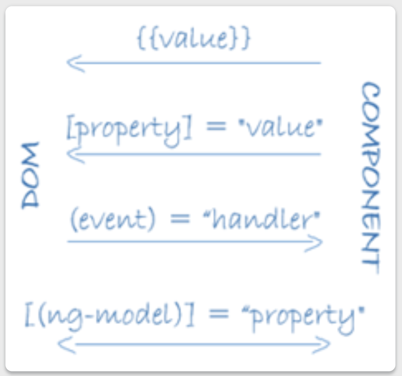

### Angular Template

A template looks like regular HTML, except that it also contains Angular template syntax, which alters the HTML based on your application's logic and the state of application and DOM data. Your template can use data binding to coordinate the application and DOM data, pipes to transform data before it is displayed, and directives to apply application logic to what gets displayed.

#### Sample template with syntax
```html
<h2>Hero List</h2>

<p><i>Select a hero from the list to see details.</i></p>
<ul>
  <li *ngFor="let hero of heroes" (click)="selectHero(hero)">
    {{hero.name}}
  </li>
</ul>

<app-hero-detail *ngIf="selectedHero" [hero]="selectedHero"></app-hero-detail>
```
<br>

#### Data Binding
___
Angular supports two-way data binding, a mechanism for coordinating the parts of a template with the parts of a component. Add binding markup to the template HTML to tell Angular how to connect both sides.

Diagram:


Example:
```html
<li>{{hero.name}}</li>
<app-hero-detail [hero]="selectedHero"></app-hero-detail>
<li (click)="selectHero(hero)"></li>
```

```
* The {{hero.name}} interpolation displays the component's hero.name property value within the `<li>` element.

* The [hero] property binding passes the value of selectedHero from the parent HeroListComponent to the hero property of the child HeroDetailComponent.

* The (click) event binding calls the component's selectHero method when the user clicks a hero's name.
```

2 Way Data Binding:
```html
<input type="text" id="hero-name" [(ngModel)]="hero.name">
```
In above example, the property hero.name of the component is binded to view, for displaying the data and also for sending the changes to data to be stored in this variable in component,
like combination of property and event.

In two-way binding, a data property value flows to the input box from the component as with property binding. The user's changes also flow back to the component, resetting the property to the latest value, as with event binding.

<br>

### PIPES
___
Angular pipes let you declare display-value transformations in your template HTML. A class with the @Pipe decorator defines a function that transforms input values to output values for display in a view.

Angular defines various pipes, such as the date pipe and currency pipe; for a complete list, see the Pipes API list. You can also define new pipes.

To specify a value transformation in an HTML template, use the pipe operator (|).

{{interpolated_value | pipe_name}}

You can chain pipes, sending the output of one pipe function to be transformed by another pipe function. A pipe can also take arguments that control how it performs its transformation. For example, you can pass the desired format to the date pipe.

Example:
```html
<!-- Default format: output 'Jun 15, 2015'-->
 <p>Today is {{today | date}}</p>

<!-- fullDate format: output 'Monday, June 15, 2015'-->
<p>The date is {{today | date:'fullDate'}}</p>

 <!-- shortTime format: output '9:43 AM'-->
 <p>The time is {{today | date:'shortTime'}}</p>
 ```

 for more details refer
 [Date Pipe](https://angular.io/api/common/DatePipe)


 ### DIRECTIVES
 Angular templates are dynamic. When Angular renders them, it transforms the DOM according to the instructions given by directives. A directive is a class with a @Directive() decorator.
 
  __Angular defines the @Component() decorator, which extends the @Directive() decorator with template-oriented features.__

There are two other kinds of directives: structural and attribute. Angular defines a number of directives of both kinds.\
Just as for components, the metadata for a directive associates the decorated class with a selector element that you use to insert it into HTML. In templates, directives typically appear within an element tag as attributes, either by name or as the target of an assignment or a binding.
 
#### Structural directives
Structural directives alter layout by adding, removing, and replacing elements in the DOM. The example template uses two built-in structural directives to add application logic to how the view is rendered.

```html
<li *ngFor="let hero of heroes"></li>
<app-hero-detail *ngIf="selectedHero"></app-hero-detail>
```
* `*ngFor` is an iterative; it tells Angular to stamp out one `<li>` per hero in the heroes list.
* `*ngIf` is a conditional; it includes the HeroDetail component only if a selected hero exists.

#### Attribute directives
Attribute directives alter the appearance or behavior of an existing element. In templates they look like regular HTML attributes, hence the name.

The ngModel directive, which implements two-way data binding, is an example of an attribute directive. ngModel modifies the behavior of an existing element (typically `<input>`) by setting its display value property and responding to change events.
