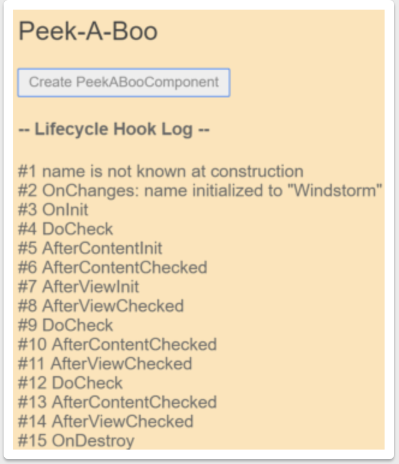

# Life cycle methods

A component instance has a lifecycle that starts when Angular instantiates the component class and renders the component view along with its child views. The lifecycle continues with change detection, as Angular checks to see when data-bound properties change, and updates both the view and the component instance as needed. The lifecycle ends when Angular destroys the component instance and removes its rendered template from the DOM. Directives have a similar lifecycle, as Angular creates, updates, and destroys instances in the course of execution.

Your application can use lifecycle hook methods to tap into key events in the lifecycle of a component or directive in order to initialize new instances, initiate change detection when needed, respond to updates during change detection, and clean up before deletion of instances.

| LifeCycles |
| ----- |
| ngOnChanges() |
| ngOnInit() |
| ngDoCheck() |
| ngAfterContentInit() |
| ngAfterContentChecked() |
| ngAfterViewInit() |
| ngAfterViewChecked() |
| ngOnDestroy() |
| |



Sample Code
```ts
let nextId = 1;

// Spy on any element to which it is applied.
// Usage: <div appSpy>...</div>
@Directive({selector: '[appSpy]'})
export class SpyDirective implements OnInit, OnDestroy {
  private id = nextId++;

  constructor(private logger: LoggerService) { }

  ngOnInit() {
    this.logger.log(`Spy #${this.id} onInit`);
  }

  ngOnDestroy() {
    this.logger.log(`Spy #${this.id} onDestroy`);
  }
}
```